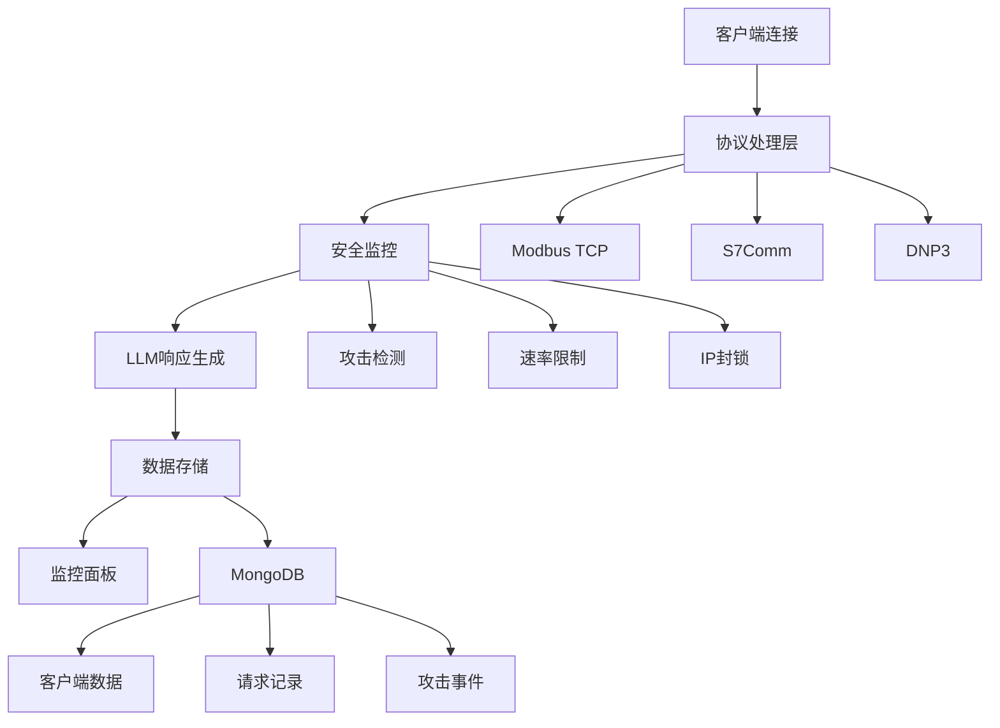

# 工控网络蜜罐系统 | Industrial Control Network Honeypot System

[](https://huggingface.co/cv43/llmpot)
[](https://www.python.org/)
[](https://www.gnu.org/licenses/gpl-3.0)

基于LLM（大语言模型）的智能工控网络蜜罐系统，支持多种工控协议和智能攻击检测。

An intelligent industrial control network honeypot system based on LLM (Large Language Model) with support for multiple industrial protocols and intelligent attack detection.

## 🎯 主要特性 | Key Features

- 🔧 **多协议支持**: Modbus TCP, S7Comm, DNP3等工控协议
- 🤖 **LLM智能响应**: 基于ByT5模型的智能响应生成
- 📊 **实时监控**: Web界面实时监控攻击活动
- 🛡️ **安全防护**: 速率限制、IP封锁、攻击检测
- 📈 **数据分析**: 完整的攻击数据收集和分析
- 🚀 **易于部署**: 支持Docker、systemd等多种部署方式

## 📋 目录结构 | Directory Structure

```
src/honeypot/deployment/
├── __init__.py              # 模块初始化
├── config.py                # 配置管理系统
├── server.py                # 蜜罐服务器核心
├── protocols.py             # 多协议处理器
├── deploy.py                # 部署脚本
├── dashboard.py             # 监控面板
├── install.py               # 自动安装脚本
└── manage.py                # 管理工具
```

## 🚀 快速开始 | Quick Start

### 方法1: 快速启动 | Method 1: Quick Start

```bash
# 1. 启动MongoDB (使用Docker)
docker run -d --name honeypot-mongodb -p 27017:27017 \
  -e MONGO_INITDB_ROOT_USERNAME=root \
  -e MONGO_INITDB_ROOT_PASSWORD=root \
  mongo:latest

# 2. 安装依赖
pip install -r requirements.txt

# 3. 快速启动蜜罐
python3 start_honeypot_quick.py
```

### 方法2: 完整安装 | Method 2: Full Installation

```bash
# 1. 自动安装
sudo python3 src/honeypot/deployment/install.py

# 2. 启动服务
sudo systemctl start honeypot

# 3. 查看状态
sudo systemctl status honeypot

# 4. 访问监控面板
open http://localhost:8080
```

### 方法3: Docker部署 | Method 3: Docker Deployment

```bash
# 1. 生成Docker文件
python3 src/honeypot/deployment/install.py --docker

# 2. 启动服务
docker-compose up -d

# 3. 查看日志
docker-compose logs -f honeypot
```

## 🔧 配置说明 | Configuration

### 基础配置 | Basic Configuration

```yaml
name: "工控网络蜜罐系统"
description: "基于LLM的智能工控网络蜜罐"
bind_address: "0.0.0.0"
```

### 协议配置 | Protocol Configuration

```yaml
protocols:
  - name: "modbus_tcp"
    port: 502
    enabled: true
    llm_enabled: true
    protocol_specific:
      slave_id: 1
      coils: 100
      holding_registers: 100
      device_info:
        vendor: "Schneider Electric"
        product_name: "Modicon M221 Logic Controller"
```

### LLM配置 | LLM Configuration

```yaml
llm:
  model_type: "byt5-small"
  device: "cpu"  # 或 "cuda"
  max_tokens: 512
  temperature: 0.7
```

## 📊 监控面板 | Monitoring Dashboard

访问 `http://localhost:8080` 查看实时监控界面：

- 📈 实时统计数据
- 🎯 攻击事件时间线
- 👥 客户端连接信息
- 📋 协议活动统计
- 🚨 攻击类型分析

## 🛠️ 管理工具 | Management Tools

### 状态查看 | Status Checking

```bash
# 查看蜜罐状态
python3 src/honeypot/deployment/manage.py status

# 查看客户端信息
python3 src/honeypot/deployment/manage.py clients

# 查看攻击信息
python3 src/honeypot/deployment/manage.py attacks
```

### 服务管理 | Service Management

```bash
# 启动服务
python3 src/honeypot/deployment/manage.py start

# 停止服务
python3 src/honeypot/deployment/manage.py stop

# 重启服务
python3 src/honeypot/deployment/manage.py restart
```

### 报告生成 | Report Generation

```bash
# 生成JSON报告
python3 src/honeypot/deployment/manage.py report --output report.json

# 查看协议统计
python3 src/honeypot/deployment/manage.py protocols
```

## 🔍 支持的协议 | Supported Protocols

### Modbus TCP
- ✅ 支持所有标准Modbus功能码
- ✅ 模拟真实PLC寄存器和线圈
- ✅ 检测异常功能码和攻击模式
- ✅ 支持设备信息模拟

### S7Comm (Siemens)
- ✅ 支持S7-200/300/400/1200/1500系列
- ✅ TPKT/COTP协议栈支持
- ✅ 设备识别和通信参数配置
- ✅ 攻击检测和日志记录

### DNP3
- ✅ 支持DNP3 Level 2协议
- ✅ 二进制和模拟量点位模拟
- ✅ 主站和从站通信模拟
- ✅ 异常检测和安全分析

## 🛡️ 安全特性 | Security Features

### 攻击检测 | Attack Detection

- 🔍 **协议层检测**: 恶意功能码、格式异常
- 📊 **行为分析**: 频率异常、连接模式分析
- 🚨 **实时告警**: 攻击事件实时通知

### 防护机制 | Protection Mechanisms

- ⚡ **速率限制**: 防止DDoS攻击
- 🚫 **IP黑名单**: 自动封锁恶意IP
- 🌍 **地理过滤**: 基于地理位置的访问控制

## 📈 数据分析 | Data Analysis

### 收集的数据 | Collected Data

- 👥 客户端连接信息
- 📨 协议请求和响应
- 🚨 攻击事件和类型
- 📊 网络流量统计

### 分析工具 | Analysis Tools

- 📊 实时统计图表
- 📋 详细攻击报告
- 📈 趋势分析
- 📤 数据导出功能

## 🔧 故障排除 | Troubleshooting

### 常见问题 | Common Issues

1. **端口被占用**
   ```bash
   sudo netstat -tulpn | grep :502
   ```

2. **MongoDB连接失败**
   ```bash
   docker ps | grep mongodb
   sudo systemctl status mongod
   ```

3. **权限问题**
   ```bash
   sudo chown -R $USER:$USER /var/log/honeypot
   ```

### 日志查看 | Log Viewing

```bash
# 查看系统日志
sudo journalctl -u honeypot -f

# 查看应用日志
sudo tail -f /var/log/honeypot/honeypot.log
```

## 🏗️ 架构设计 | Architecture Design



## 📚 API文档 | API Documentation

### REST API端点 | REST API Endpoints

```
GET /api/config       # 获取配置信息
GET /api/stats        # 获取统计信息
GET /api/clients      # 获取客户端列表
GET /api/requests     # 获取请求记录
GET /api/attacks      # 获取攻击事件
GET /api/protocols    # 获取协议统计
```

### 使用示例 | Usage Examples

```bash
# 获取统计信息
curl http://localhost:8080/api/stats

# 获取攻击事件
curl http://localhost:8080/api/attacks
```

## 🤝 贡献指南 | Contributing

1. Fork 本仓库
2. 创建功能分支 (`git checkout -b feature/AmazingFeature`)
3. 提交更改 (`git commit -m 'Add some AmazingFeature'`)
4. 推送到分支 (`git push origin feature/AmazingFeature`)
5. 创建 Pull Request

## 📄 许可证 | License

本项目采用 GPL v3 许可证 - 详见 [LICENSE](LICENSE) 文件

## 🙏 致谢 | Acknowledgments

- 感谢所有贡献者和测试者
- 基于 [LLMPot](https://github.com/WhhPisces/LLMPot) 项目
- 感谢工控安全研究社区的支持

## 📞 技术支持 | Technical Support

- 📧 Email: support@example.com
- 🐛 Issues: [GitHub Issues](https://github.com/WhhPisces/LLMPot/issues)
- 📖 文档: [在线文档](https://llmpot.readthedocs.io/)

---

**⚠️ 免责声明**: 本工具仅用于教育和研究目的，使用者需遵守当地法律法规。

**⚠️ Disclaimer**: This tool is for educational and research purposes only. Users must comply with local laws and regulations.